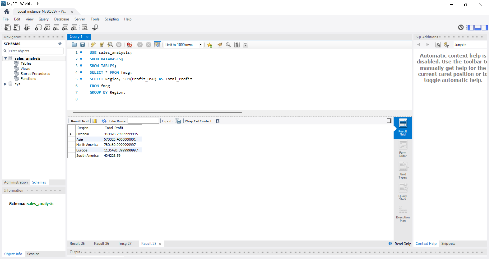
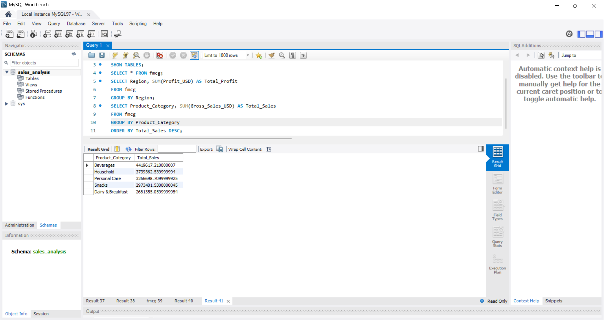
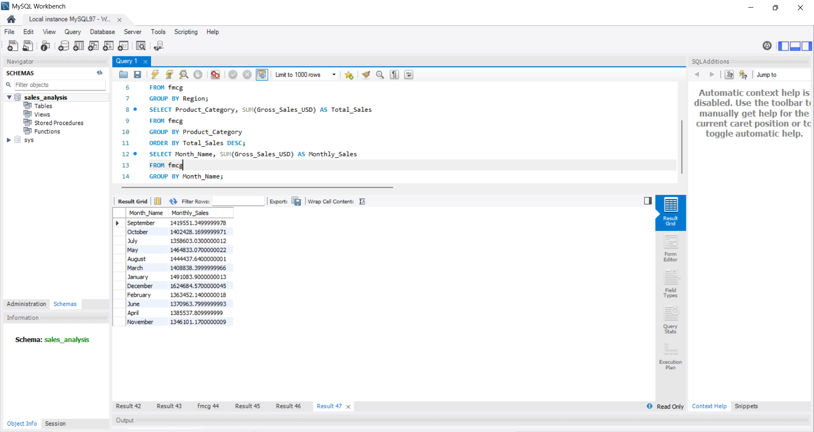

# SQL Sales Analysis using MySQL

## Overview

This project analyzes FMCG sales data using SQL queries in MySQL Workbench to generate business insights.

## Queries Performed

* Region-wise profit analysis
* Product category sales analysis
* Monthly sales trend analysis

## Tools Used

* MySQL
* MySQL Workbench
* SQL Queries

## Key SQL Concepts

* SELECT
* GROUP BY
* ORDER BY
* SUM
* Aggregate Functions

## Project Screenshots

## Author

Siva Ranjani S
MBA Business Analytics
Aspiring Data Analyst

